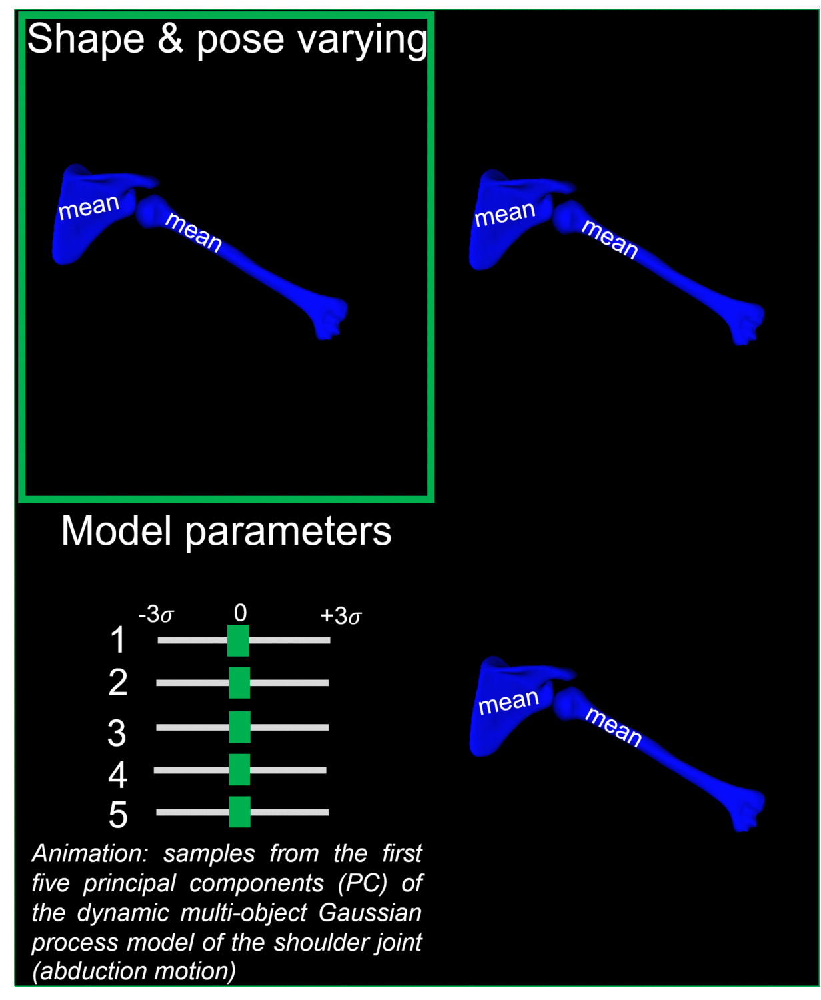

# DmoGpm
Scalable Dynamic Multi Shape  Modelling

# Introduction

This project aims to offer easy access to the modeling framework for multi-structures from interest from Medical images (MRI, CT scans etc.).
It is a system that allows the easy creation of a dynamic mult-shape models, which can be trained to detect and segment structures from 3D/2D images.

The project code is implated in Scalismo software(https://unibas-gravis.github.io/scalismo-microsite) and is being cleaning up to release soon for public use.  Accompanying data are wiil be provided to run the preset examples and make sure that the 
system is functioning on your system.  
The gif below describes the main functionality, in order for the user to understand the main processing cycle. 
We hope this project will serve well in making the state-of-the-art dynamic shape modelling more accessible in the field of medical imaging.

                               

